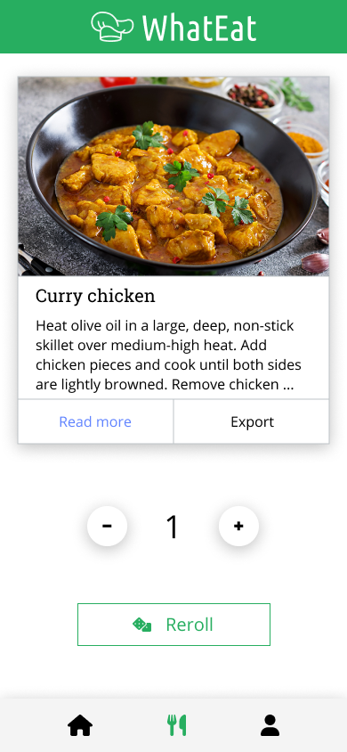

---
graphics: true
geometry: true
lang: "fr"
toc: true
toc-own-page: true
colorlinks: blue
custom-title-page: true
custom-title-page-logo: images/logo.png
fontfamily: sourcesanspro
fontfamilyoptions: default
title: "Cahier des charges"
subtitle: "Cours PDG"
location: "HEIG-VD"
linestretch: 1.3
tables: true
...

# Introduction

Dans le cadre du cours PDG de la HEIG-VD, nous avons décidé de créer l’application **WhatEat.** 

Cette application permet d’aider toutes les personnes qui, comme nous, manquent d’inspiration chaque jour lorsqu’il s’agit de choisir un repas à se préparer. 

Il sera ainsi possible de créer son compte, d’y enregistrer ses préférences (aliments, difficulté des plats, allergie, régime alimentaire, etc) et de trouver chaque jour des plats à préparer qui satisfont toutes les contraintes. 

# Outils existants

Actuellement, il existe quelques outils permettant de rechercher des plats en fonction de certains critères (aliments, allergie etc..). Cependant, ces outils sont très peu connus, souvent payants et proposent des interfaces pas très “user friendly”. 

WhatEat est adapté pour toutes les plateformes et propose une interface simple et ergonomique. Il n’est pas nécessaire d’installer une app et tout est accessible directement depuis une simple URL.

# Objectifs

Nous séparons les objectifs en deux, à savoir les objectifs de types **MUST** et les objectifs **WISH :**

- **MUST :** Ce sont les objectifs que nous souhaitons réaliser d’ici la fin des 3 semaines de projet
- **WISH :** Ce sont les objectifs que nous souhaiterions réaliser si le temps nous le permet, ou si le développement de l’application continuait après le temps imparti.

## MUST

WhatEat Today:

Chaque jour une nouvelle recette est proposée à l’utilisateur en fonction des préférences qui ont été fournies dans l’application.

Si la recette proposée ne convient pas, il est alors possible d’en demander une nouvelle.

L’utilisateur doit pouvoir exporter facilement en tant qu’image la recette du jour proposée.

## WISH

WhatEat Fridge:

L’application propose des recettes en fonction d’une liste d’ingrédients. Chaque jour, l’utilisateur peut saisir la liste des ingrédients qu’il possède puis l’application trouve automatiquement une liste de recettes adaptées afin de réduire le gaspillage.

\pagebreak

WhatEat Week:

L’application propose un planning alimentaire complet pour la semaine. L’utilisateur possède alors une liste complète des 7 prochains jours avec pour chaque jour 2 recettes. Cette fonctionnalité est très utile pour les utilisateurs qui souhaitent faire leurs courses en avance et ainsi planifier tous les repas à l’avance. 

Multi language:

L’application se voulant utilisable par le plus grand nombre, un choix entre les trois langue nationales et l’anglais sera proposé aux utilisateur dans les paramètres. Par défaut, l’application est en anglais.

# Besoins

## Besoins fonctionnels

LandingPage:

- L’utilisateur non connecté voit toutes les informations conceranant WhatEat, de plus il lui est proposé de s’enregistrer / se connecter
- L’utilisateur déjà connecté est immédiatement redirigé sur la page WhatEat Today

Page WhatEat Today :

- L’utilisateur voit une recette filtrée en fonction de ses préférences.
- L’utilisateur peut demander une nouvelle recette.
- L’utilisateur peut choisir le nombre de personne
- L’utilisateur peut afficher la page “détails de la recette”

Page Register:

- L’utilisateur peut s’enregistrer avec une adresse email
- L’utilisateur doit avoir un mot de passe au norme du site.
- Une fois enregistré il est redirigé sur sa page de préférences

Page Détails de la recette:

- L’utilisateur peut voir les détails de la recette
- L’utilisateur peut exporter la recette en PDF

\pagebreak

Page Préférence :

- L’utilisateur peut renseigner ses préférences culinaires facilement.
    - **Allergies :**
        
        | Dairy | Egg | Sesame | Sulfite |
        |--|--|--|--|
        | Gluten | Grain | Shellfish | Tree Nut |
        | Peanut | Seafood | Soy | Wheat |

    - **Particularités :**
        
        | Gluten Free | Ketogenic |
        | -- | -- |
        | Vegan | Vegetarian |
        | Pescetarian | Paleo |

    - **Manger sain :**

        - Oui
        - Pas forcémment

    - **Temps de préparation :**

        - Rapide (< 20min)
        - Moyen (< 30 min)
        - J’ai le temps (No Limit)

    - **Cuisine préférées :**
        
        | African | Cajun | Eastern European | German |
        | -- | -- | -- | -- |
        | American | Caribbean | Eurpoean | Greek |
        | British | Chinese | French | Indian |
        | Irish | Italian | Japanase | Jewish |
        | Korean | Latin American | Mediterranean | Mexican |
        | Middle Eastern | Nordic | Southern | Spanish |
        | Thai | Vietnamese |  |  |
    
- L’utilisateur peut changer son mot de passe.
- L’utilisateur peut se déconnecter

Page Login :

- L’utilisateur peut s’identifier au moyen d’un email et un mot de passe

## Besoins non-fonctionnels

- Performance : Le site web doit charger en moins de 5 secondes.
- Ergonomie : La navigation doit être fluide entre les pages.
- Compatibilité : Adaptation entre les plateformes (Ordinateur/smartphone)

# Mockups

| { height=400px } | { height=400px } |
| -- | -- |
| { height=400px } | { height=400px width=400px } |
| { height=400px } |  |

