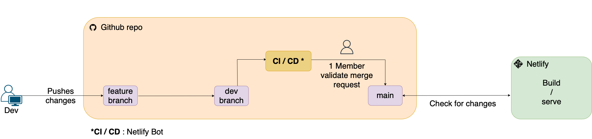
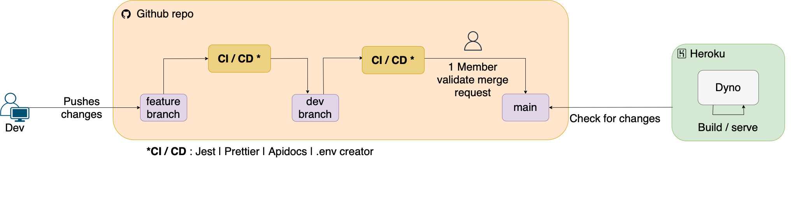

---
graphics: true
geometry: true
lang: "fr"
toc: true
toc-own-page: true
colorlinks: blue
custom-title-page: true
custom-title-page-logo: images/logo.png
fontfamily: sourcesanspro
fontfamilyoptions: default
title: "Prise en main"
subtitle: "Cours PDG"
location: "HEIG-VD"
linestretch: 1.3
tables: true
numbersections: true
...

# Introduction

Ce document a pour objectif de vous expliquer comment installer et utiliser WhatEat sur votre machine. 

WhatEat est composé d'un frontend et d'un backend. Le frontend est un serveur web qui gère l'affichage des recettes et l'interface utilisateur. Le backend est une API qui propose divers endpoint, appelle la base de données et effectue des appels à l'API de `Spoonacular`. 

`Spoonacular` est une API qui permet de rechercher des recettes et de les afficher. Si vous souhaitez utiliser WhatEat, il est nécessaire d'obtenir un token pour cette API au préalable.

# Prérequis

Les prérequis suivants sont nécessaires pour installer WhatEat :

* [Node.js](https://nodejs.org/en/)
* [npm](https://www.npmjs.com/)
* [Git](https://git-scm.com/)

# Configuration du projet

Pour pouvoir faire tourner WhatEat sur votre machine, voici les étapes à suivre :

## Backend

Le backend utilise NodeJS et Express ainsi qu'une base de données MongoDB. 

1. Cloner le projet

```bash
git clone https://github.com/WhatEatInc/WhatEat-back 
```

2. Créer le fichier `.env`

Une fois le projet cloné, il est nécessaire de créer un fichier `.env` qui contiendra les différentes variables d'environnement. Vous pouvez renommer le fichier `.env.example` en `.env` et remplir les différentes variables. Pour ce fichier, vous devez posséder une clé d'API pour Spoonacular ainsi qu'une base de données MongoDB.

Pour le secret du token JWT, vous pouvez saisir un mot de passe aléatoire.

3. Installer les dépendances

```bash
npm install
```

4. Lancer le serveur

Pour lancer le serveur en mode `dev`, il suffit de lancer la commande

```bash
npm run dev
```

Pour lancer le serveur en mode `prod`, il suffit de lancer la commande

```bash
npm run start
```

Il est ensuite possible d'effectuer des requêtes HTTP sur l'API du backend.

```HTTP
GET http://localhost:<PORT>/
```

## Frontend

Le frontend utilise ReactJS


1. Cloner le projet

```bash
git clone https://github.com/WhatEatInc/WhatEat-front 
```

2. Créer le fichier `.env`

Une fois le projet cloné, il est nécessaire de créer un fichier `.env` qui contiendra les différentes variables d'environnement. Vous pouvez renommer le fichier `.env.example` en `.env` et remplir les différentes variables.

3. Installer les dépendances

```bash
npm install
```

4. Lancer le serveur
```bash
npm run start
```
Vous pouvez ensuite accéder à la page d'accueil du site via l'adresse suivante : [http://localhost:3000/](http://localhost:3000/)


# Documentation de l'API

La documentation de l'API du backend est disponible à l'adresse suivante : 

[https://whateat-backend.herokuapp.com/v0/docs/](https://whateat-backend.herokuapp.com/v0/docs/)

\pagebreak

# Structure du projet

Pour avoir une meilleure vue d'ensemble du projet, voici la structure des dossiers et fichiers du backend et du frontend. 

## Backend

\begin{TreeStruct}{Structure des dossiers du backend}
		\setstretch{0.83}
		\begin{multicols}{2}
			\dirtree{%
                .1 apidoc/.
                .1 src/.
                .2 config/.
                .2 controllers/.
                .3 auth.controllers.js.
                .3 recipe.controllers.js.
                .3 user.controllers.js.
                .2 models/.
				.3 user.model.js.
				.3 preference.model.js.
                .3 recipe.model.js.
                .2 routes/.
                .3 v0/.
				.4 apiDoc.routes.js.
				.4 recipe.routes.js.
				.4 user.routes.js.
				.4 v0.routes.js.
                .2 tests/.
                .2 app.js.
                .2 server.js.
                .1 .env.
			}

			\columnbreak
            \begin{small}
                Contient la documentation de l'API \\
                \\
                Fichiers de configs nécessaire à l'app \\
                Gère la logique \\
                Gestion de l'authentification \\
                Gestion des recettes \\
                Gestion des utilisateurs \\
                Gère les données et leur structure \\
				Modèle de l'utilisateur \\
				Modèle des préférences \\
                Modèle des recettes \\
                Contient les routes de l'API \\
                \\
				Routes de la documentation \\
				Routes des recettes \\
				Routes des utilisateurs \\
				Routes de la v0 de l'API \\
                Contient les tests de l'application \\
                Point d'entrée de l'application \\
                Contient la connexion à la DB \\
                Contient les variables d'environnement \\
            \end{small}
		\end{multicols}
	\end{TreeStruct}

## Frontend

\begin{TreeStruct}{Structure des dossiers du frontend}
		\setstretch{0.85}
		\begin{multicols}{2}
			\dirtree{%
                .1 public/.	
				.2 index.html.	
				.1 src/.
				.2 components/.		
				.3 app/.
				.4 App.js.
				.4 WhatEat.js.
				.3 button/.
				.3 counter/.
				.3 error/.
				.3 footer/.
				.3 header/.
				.3 ingredients/.
				.3 recipe-card/.
				.3 settings/.
				.3 steps/.
				.2 config/.
				.2 css/.
                .3 base/.
                .3 components/.
				.2 images/.
				.2 pages/.
				.2 index.js.
                .1 .env.
			}
		
			\columnbreak
            \begin{small}
                Point d'entrée de l'application \\
                \\
				\\
                Contient des fonctionnalité spécifique de l'app \\
                \\
				Composant principal de l'application \\
				Composant principal du site web \\
                Défini les boutons \\
                Défini le compteur \\
                Défini les messages d'erreurs \\
                Défini la bannière en bas de l'application \\
                Défini la bannière en haut de l'application \\
                Défini l'affichage de la liste des ingrédients \\
                Défini l'affichage de la recette \\
                Défini les champs des paramètres \\
                Défini l'affichage des étapes de la recette \\
                Contient les configs pour l'API \\
                Contient les fichiers de style de l'app \\
                Fichiers de styles globaux \\
                Fichiers de styles des composants \\
                Contient les images de l'application \\
                Contient les pages de l'application \\
				Point d'entrée de l'application ReactJS \\
                Contient les variables d'environnement \\
            \end{small}
		\end{multicols}
	\end{TreeStruct}

# Nouveau développeur dans l'équipe WhatEat

Si vous êtes nouveau développeur dans l'équipe de WhatEat et que vous souhaitez prendre en main le projet, voici les différentes étapes à suivre pour pouvoir travailler sur le projet.

## Prérequis

Pour pouvoir travailler sur le projet, veuillez avoir lu au préalable la première partie de ce document afin d'avoir les connaissances nécessaires pour installer et configurer le projet. 

## Méthodes de développement

Lorsque vous collaborez sur le projet WhatEat, merci de bien vouloir respecter les méthodes de développement décrites dans le document [Rapport de projet](https://github.com/WhatEatInc/WhatEat-doc/tree/main/Rapport%20de%20projet) plus précisément au chapitre [Méthodes de développement](https://github.com/WhatEatInc/WhatEat-doc/tree/main/Rapport%20de%20projet#m%C3%A9thodes-de-d%C3%A9veloppement)

Dans ce chapitre vous trouverez les différentes manières d'organiser les branches, gérer les issues, nommer ses commit, etc...

## Mise en place des outils de développement

Afin d'avoir un environnement de développement similaire à celui des autres développeurs, veuillez suivre les étapes décrites dans le document [Rapport de projet](https://github.com/WhatEatInc/WhatEat-doc/tree/main/Rapport%20de%20projet) plus précisément au chapitre [Mise en place des outils de développement](https://github.com/WhatEatInc/WhatEat-doc/tree/main/Rapport%20de%20projet#mise-en-place-des-outils-de-d%C3%A9veloppement)

## Environnement de déploiement et pipeline de livraison

Pour terminer, il vous est fortement conseillé d'aller lire la chapitre [Mise en place d’un environnement de déploiement](https://github.com/WhatEatInc/WhatEat-doc/tree/main/Rapport%20de%20projet#mise-en-place-dun-environnement-de-d%C3%A9ploiement) et [Mise en place d’un pipeline de livraison et de déploiement (CI/CD)](https://github.com/WhatEatInc/WhatEat-doc/tree/main/Rapport%20de%20projet#mise-en-place-dun-pipeline-de-livraison-et-de-d%C3%A9ploiement-cicd) afin de comprendre comment le projet est déployé et comment le pipeline de livraison fonctionne. (Voir la figure ci-dessous)

\pagebreak

## Pipeline de livraison

Pour rappel, le pipeline de livraison est le suivant :



